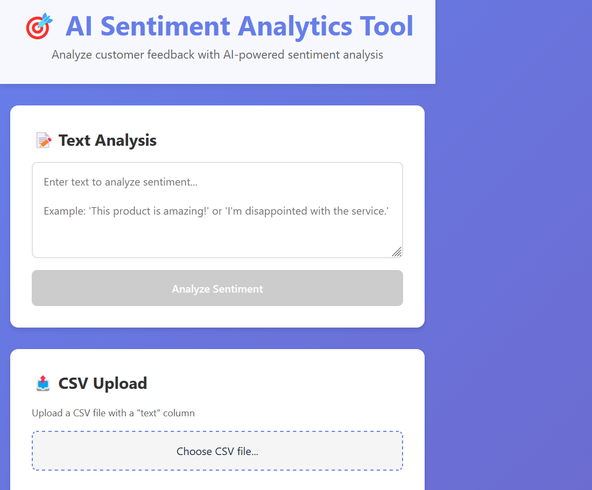
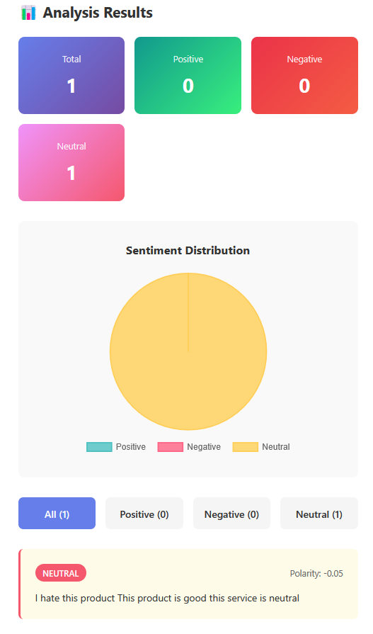
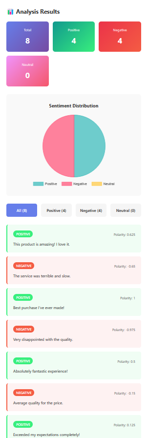
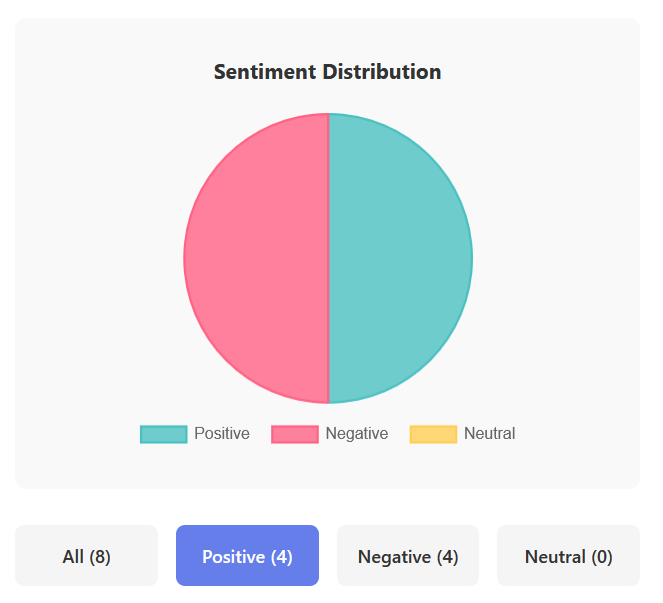

# 🎯 AI-Driven Sentiment & Feedback Analytics Tool

A full-stack web application that uses AI to analyze customer feedback sentiment in real-time. Built with React, FastAPI, and TextBlob for natural language processing.



## 🌟 Live Demo

- **Frontend**: [https://sentiment-analytics-tool.vercel.app/](https://sentiment-analytics-tool.vercel.app/)
- **Backend API**: [https://sentiment-analytics-tool.onrender.com](https://sentiment-analytics-tool.onrender.com)
- **API Documentation**: [https://sentiment-analytics-tool.onrender.com/docs](https://sentiment-analytics-tool.onrender.com/docs)

## ✨ Features

- 📝 **Single Text Analysis** - Analyze individual feedback instantly
- 📤 **Batch CSV Upload** - Process multiple feedbacks at once
- 📊 **Visual Analytics** - Interactive pie charts showing sentiment distribution
- 🔍 **Smart Filtering** - Filter results by positive, negative, or neutral sentiment
- 🎨 **Modern UI** - Clean, responsive design with gradient themes
- ⚡ **Real-time Processing** - Fast sentiment analysis using TextBlob NLP
- 📈 **Detailed Metrics** - Polarity scores and sentiment classification

## 🖼️ Screenshots

### Text Analysis


### CSV Upload & Results


### Sentiment Chart


## 🛠️ Tech Stack

### Frontend
- **React** (Vite) - Fast, modern UI framework
- **Chart.js** - Data visualization
- **Axios** - HTTP client
- **CSS3** - Custom styling with gradients

### Backend
- **FastAPI** - High-performance Python web framework
- **TextBlob** - Natural Language Processing
- **Pandas** - Data manipulation
- **Uvicorn** - ASGI server

### Deployment
- **Frontend**: Vercel
- **Backend**: Render
- **Version Control**: GitHub

## 🚀 Getting Started

### Prerequisites

- Node.js 20.19+ or 22.12+
- Python 3.10+
- Git

### Local Installation

1. **Clone the repository**
```bash
git clone https://github.com/objemmanuel/sentiment-analytics-tool.git
cd sentiment-analytics-tool
```

2. **Set up Backend**
```bash
cd backend

# Create virtual environment
python -m venv venv

# Activate virtual environment
# Windows (Git Bash):
source venv/Scripts/activate
# Windows (PowerShell):
venv\Scripts\Activate.ps1
# Mac/Linux:
source venv/bin/activate

# Install dependencies
pip install -r requirements.txt

# Run backend server
python main.py
```

Backend will run on `http://localhost:8000`

3. **Set up Frontend**
```bash
cd ../frontend

# Install dependencies
npm install

# Create .env file
echo "VITE_API_URL=http://localhost:8000" > .env

# Run development server
npm run dev
```

Frontend will run on `http://localhost:5173`

## 📖 Usage

### Analyze Single Text

1. Enter your feedback text in the text area
2. Click "Analyze Sentiment"
3. View the sentiment result (positive/negative/neutral) with polarity score

### Batch Analysis with CSV

1. Prepare a CSV file with a `text` column
2. Click "Choose CSV file" and select your file
3. Click "Upload & Analyze"
4. View summary statistics, pie chart, and detailed results
5. Use filters to view specific sentiment categories

### Sample CSV Format
```csv
text
This product is amazing! I love it.
The service was terrible and slow.
It's okay, nothing special.
Best purchase I've ever made!
Very disappointed with the quality.
```

## 🎨 Features in Detail

### Sentiment Classification

The tool classifies text into three categories:

- **Positive** (polarity > 0.1): Green badge
- **Negative** (polarity < -0.1): Red badge
- **Neutral** (polarity between -0.1 and 0.1): Yellow badge

### Metrics Provided

- **Polarity**: Range from -1 (very negative) to +1 (very positive)
- **Subjectivity**: Range from 0 (objective) to 1 (subjective)
- **Distribution**: Total count and percentage for each sentiment

## 🔗 API Endpoints

### `GET /`
Welcome message with available endpoints

### `GET /health`
Health check endpoint

### `POST /analyze`
Analyze single text
```json
{
  "text": "Your feedback here"
}
```

### `POST /analyze-batch`
Upload CSV file for batch analysis
- Accepts: `multipart/form-data`
- File must have `.csv` extension
- Must contain `text` column

## 🧪 Testing

### Test Backend
```bash
# Health check
curl https://sentiment-analytics-tool.onrender.com/health

# Analyze text
curl -X POST "https://sentiment-analytics-tool.onrender.com/analyze" \
  -H "Content-Type: application/json" \
  -d '{"text": "This is amazing!"}'
```

### Test Frontend
1. Open the app in your browser
2. Try text analysis with different sentiments
3. Upload sample CSV file
4. Test filtering functionality

## 📦 Deployment

### Backend (Render)

1. Push code to GitHub
2. Create new Web Service on Render
3. Connect GitHub repository
4. Set Root Directory to `backend`
5. Build Command: `pip install -r requirements.txt`
6. Start Command: `uvicorn main:app --host 0.0.0.0 --port $PORT`

### Frontend (Vercel)

1. Push code to GitHub
2. Import project on Vercel
3. Set Root Directory to `frontend`
4. Add environment variable: `VITE_API_URL`
5. Deploy!

## 🤝 Contributing

Contributions are welcome! Please feel free to submit a Pull Request.

## 📄 License

This project is licensed under the MIT License.

## 👨‍💻 Author

**Your Name**
- GitHub: [@objemmanuel](https://github.com/objemmanuel)
- LinkedIn: [Obiajulu Emmanuel](https://www.linkedin.com/in/obiajulu-emmanuel-609170234)

## 🙏 Acknowledgments

- TextBlob for NLP capabilities
- FastAPI for the excellent Python framework
- React and Vite for modern frontend development
- Render and Vercel for free hosting

## 📧 Contact

For questions or feedback, please open an issue or reach out via LinkedIn.

---

⭐ If you found this project helpful, please give it a star!